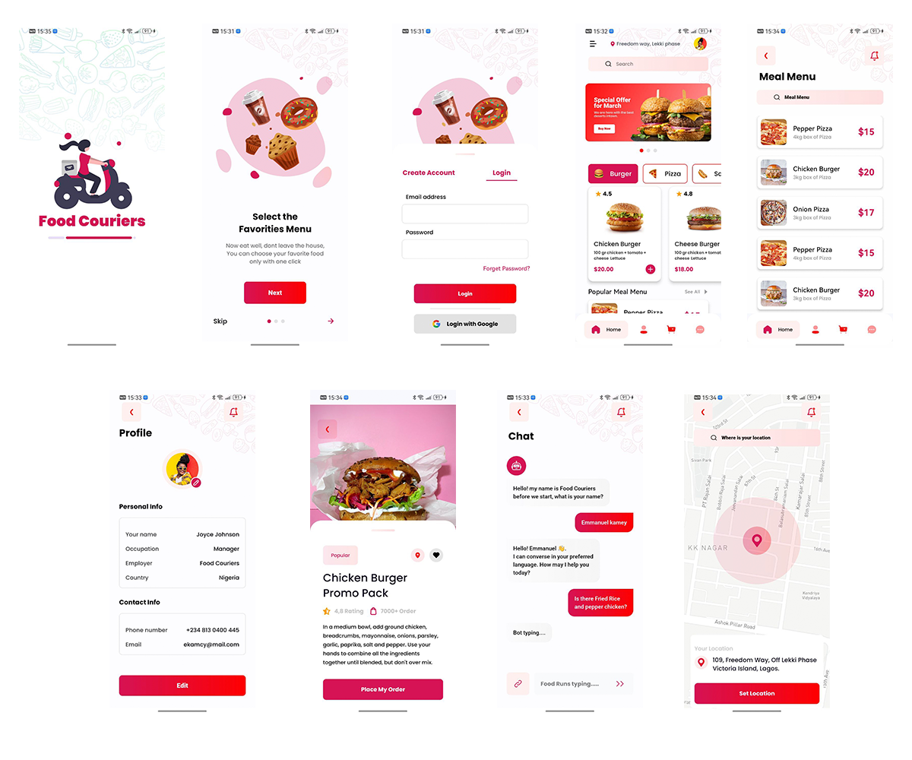

# 🍔 Food Couriers - Food Delivery App
**Pet-проект для портфолио | C упором на UI/UX**

<div align="center">
  
  <p>Основные экраны</p>
</div>

## 🎨 О дизайне проекта
Проект реализует UI-кит из **Figma community**:  
**"Food Delivery Mobile App"** автор: [El Kamcy Speaks](https://www.figma.com/@elkamcyspeaks) || [Макет Figma](https://www.figma.com/community/file/1205134361239673955/food-couriers-food-delivery-app-ui-ux-design-case-study)

> **Важно!** Все права на оригинальный дизайн принадлежат автору. Данная реализация - учебный пример для демонстрации навыков разработки.

## ✨ Особенности реализации

### Технологии:
- **Ядро:** Jetpack Compose (100% Kotlin)
- **Архитектура:** MVI + Clean Architecture
- **Figma:** UX/UI
- **Зависимости:**
    implementation("androidx.navigation:navigation-compose:2.8.9")  
    implementation("androidx.lifecycle:lifecycle-viewmodel-compose:2.8.7")  
    implementation("androidx.lifecycle:lifecycle-runtime-compose:2.8.7")  
    implementation("androidx.compose.foundation:foundation:1.8.0")  
    implementation("androidx.compose.ui:ui:1.8.0")  
    implementation("androidx.compose.material3:material3:1.3.2")


### Как запустить проект?

Клонируйте репозиторий:
```bash
git clone https://github.com/Cyrill-Mihajlowski/FoodCouriers.git
```

## 👨💻 Автор
**Почта:** dev.cyrill.mihajlowski.2002@gmail.com
**Telegram**: @Cyrill_Mihajlowski
[HeadHunter](https://hh.ru/resume/fbe29988ff0e8ad2ff0039ed1f41383979506a)

### 📄 Лицензия
```bash
MIT License
Copyright (c) 2025 Cyrill Mihajlowski
```
